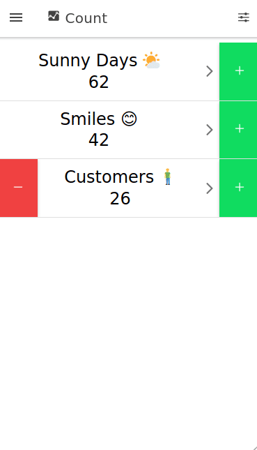

# <a href="https://github.com/Enteee/count"></a> count [][GitHubPages] [][Build] [](https://coveralls.io/github/Enteee/count?branch=master) [][count] [][count] [][count]
_Count, Visualize, Understand_

<a href="https://enteee.github.io/count">
  
</a>

An open source community driven tally counter app with advanced visualizations.
This app was created using [Ionic Framework][Ionic] and runs on Android, iOS and in [the browser][GitHubPages].

[](https://enteee.github.io/count)

**Features**

* Visualizations:
  * Plus Minus Totals Pie Chart
  * Day of Week Histogram
  * Day of Month Histogram
  * Hour or Day Radar
  * Year Heatmap
* [Preview on GitHub Pages][GitHubPages]
* Count using swipe gestures
* Full screen counting
* Count on multiple counters in parallel
* Lock a counter
* Vibrate on count
* Automatic reset to 0 on configurable limit
* Optional position recording on count
* Preview unimplemented features
* Dynamic update channel selection (Beta, Production)
* [GitHub] and [IssueHunt] integration
* Contributors overview
* Online help

## Running

```
$ ionic cordova run browser -l
```

## Contributing

We encourage you to contribute to this project :wrench: :rocket: ! Please check out the [Contributing guide](/CONTRIBUTING.md) for guidelines about how to proceed. Join us!

### Getting started

Start without cordova (some features won't work):

```
$ ionic serve
```

### Update All Icons

```
$ ./icon_update.sh
```

## Acknowledgment

count was built using the following open source frameworks and libraries:

* [Ionic](https://ionicframework.com/)
* [Angular](https://angular.io/)
* [apexcharts.js](https://apexcharts.com/)
* [Apache Cordova](https://cordova.apache.org/)
* [cerialize](https://github.com/weichx/cerialize)
* [uuid](https://github.com/uuidjs/uuid)

Thank you :heart:

## License

count is licensed under [GNU Affero General Public License 3.0](https://www.gnu.org/licenses/agpl-3.0.en.html). For commercial use a dual licensing scheme is available. Please get in touch via email: count@duckpond.ch

[Ionic]:https://ionicframework.com/
[count]:https://github.com/Enteee/count
[GitHub]:https://github.com/
[GitHubPages]:https://enteee.github.io/count
[Coverage]:https://coveralls.io/github/Enteee/count?branch=master
[Build]:https://github.com/Enteee/count/actions
[IssueHunt]:https://issuehunt.io/
